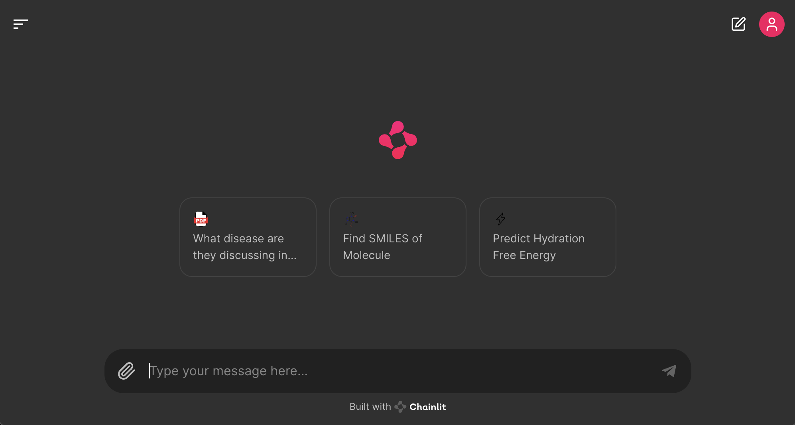

# takehome-valence
I wanted to show what I could do, so I went overboard with the project. I implemented a few extra features that I thought would be useful:
- I thought it was boring to retrieve from a static pdf file... so I integrated the PubMed API to chat with any OpenAccess article.
- The LangChain agent is deployed as a chat interface using chainlit.





Other than that, the project uses:
- Cohere Command-R-Plus as the agent
- Pinecone as the vectorstore and similarity search engine
- The Pubchem database for SMILES information
- A stacking ensemble model to predict the hydration free energy


## Installation
```bash
git clone https://github.com/ThomasRochefortB/takehome-valence.git
cd takehome-valence
conda env create -f environment.yaml
conda activate takehome_valence
```

Setup your API keys in a .env file in the root directory of the project. 
```bash
COHERE_API_KEY=your_api_key
PINECONE_API_KEY=your_api_key
```

## Usage
You can go through the steps of the takehome via the working_notebook.ipybn file, but I also implemented a chat interface using chainlit.

-> To launch the chat interface, run the following command:
```bash
chainlit run app.py
```


## Hydration free energy prediction model:

| Model    | 10-fold CV Mean RMSE  across folds | 10-fold CV Mean MAE across folds |   |
|----------|------------------------------------|----------------------------------|---|
| Ridge    |                                    |                                  |   |
| RF       |                                    |                                  |   |
| LGBM     |                                    |                                  |   |
| Voting   |                                    |                                  |   |
| Stacking |                                    |                                  |   |